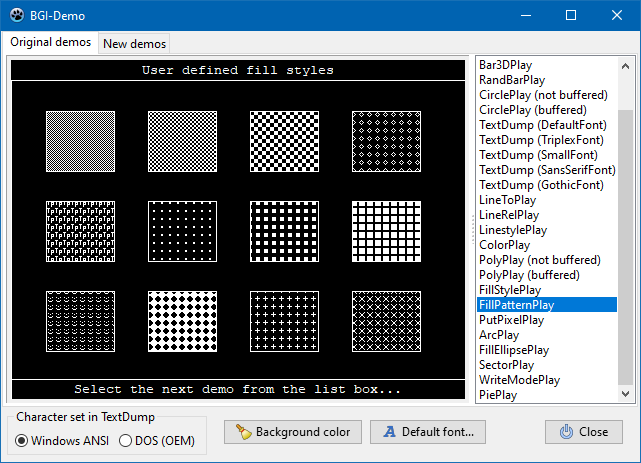

# LazBGI
Emulation of Turbo Pascal's BGI graphics commands for Lazarus



## Installation

Simply copy the unit `lazBGI.pas` to the folder of your project.

## Usage

- Add a descendant of `TGraphicControl` (`TPaintbox`) or `TCustomControl` (`TPanel`) to
  the form. A paintbox is recommended, but it is also possible to paint
  directly on a form.
  The BGI painting then is executed on the rectangle defined by this control.
  The top/left corner of this control has the BGI coordinates (0, 0), and the
  bottom/right corner has (`GetMaxX`, `GetMaxY`).

- BGI commands must begin with `InitGraph()`. In contrast to BGI, the routine does
  not provide the graphics driver, but the canvas onto which the output is 
  painted, e.g. `Paintbox1` or `Form1`. The other two parameters define the width and
  height of the drawing area:

```pascal
    InitGraph(Paintbox1.Canvas, Paintbox1.Width, Paintbox1.Height);
```
     
- Then the rest of the BGI commands follow like in an original ancient DOS
  program, such as `Line()`, `OutText()`, `Circle()` etc.

- `CloseGraph` at the end of the graphic output is no longer absolutely required
  any more since the system cannot be switched back to text mode.
  `CloseGraph`, however, cleans up memory usage - it will be called automatically
  at the end of the program nevertheless.

- The graphics commands must be called from a routine of the painting cycle of
  the container control. In case of `TPaintBox`, `TPanel` or `TForm`, this is the
  `OnPaint` event.

- Note that the `OnPaint` handler must be able to paint the entire control.

- In DOS, often the same function was painted over the same graphic with
  different parameters - this was possible because of the persistent screen
  memory. This is not possible any more because the OS can reqest a complete
  repaint at any time and thus erase the previous drawing. An exception is
  painting into a temporary buffer bitmap - see below.

- Also be prepared of surprises when random numbers are used for some drawing
  parameters, such as in Borland's BGIDEMO.

- The BGI painting routine, by no means, must be allowed to wait for user input
  like in the original BGIDEMO. User input must be handled by the usual
  LCL `OnKey*` and `OnMouse*` events outside the painting routine.

- If nevertheless several curves are to be painted above each other, or if
  a flicker-free animation is supposed to be shown then the BGI graphic can
  be buffered:

  - When the graph is supposed to be drawn upon a button click the drawing
    commands must be put into the `OnClick` event handler of the button.
    The canvas for painting must be the canvas of a temporary bitmap, and the
    drawing routine must trigger a repaint of the control on which the BGI
    graphic is supposed to appear (`Paintbox1.Invalidate`). In the `OnPaint`
    handler of the control (`Paintbox`, `Panel`, `Form`, ...) the BGI graphic must
    be copied from the bitmap buffer to the control canvas:            

```pascal
      var
        Buffer: TBitmap;

      procedure TForm1.Button1Click(Sender: TObject);
      begin
        FreeAndNil(Buffer);
        Buffer := TBitmap.Create
        InitGraph(Buffer.Canvas, Paintbox1.Width, Paintbox1.Height);
        {... BGI graphics commands ... }
        CloseGraph;
        Paintbox1.Invalidate;
      end;

      procedure TForm1.Paintbox1Paint(Sender: TObject);
      begin
        Paintbox1.Canvas.Draw(0, 0, Buffer);
      end;
      
      procedure TForm1.FormDestroy(Sender: TObject);
      begin
        FreeAndNil(Buffer);  // do not forget to free the buffer bitmap
      end;
```

## Differences to BGI

- Palette function are not emulated. Colors are rendered by the modern OS in a
  much more general way then by the BGI. Access to colors defined by constants
  `Black`, `Red`, `LightGray` etc is possible. More than that, colors can also
  be defined by `SetRGBColor()` and `SetRGBBkColor()` (for line/text and background
  fill, respectively). Unlike in the OS, texts are not painted in their own
  color, but by the line color.

- Page switching by `SetActivePage`/`SetVisualPage` is not supported at the moment.

- Line types are displayed correctly only with line thickness 1 (NormWidth),
  otherwise only solid lines are shown. Unlike in the BGI, line thicknesses
  other than 1 (`NormWidth`) or 3 (`ThickWidth`) can be selected.
  New line type `DashDotDotLn`.
  User-defined line patterns are not supported at the moment.

- The LCL provides less fill patterns as the BGI. Therefore, all non-empty and
  non-solid fill patterns are emulated by means of bitmaps, in the same way
  as user-defined fill patterns. Moreover, a rectangle can also be filled by
  a linear color gradient (`GradientRect()`).

- Text output uses the same fonts as the LCL, Borlands CHR vector fonts are not
  supported. Using `SetDefaultFont`, `SetTriplexFont`, etc. you can define which
  fonts of the OS are supposed to be used instead of the BGI fonts (DefaultFont,
  Triplex, Small, SansSerif, Gothic), and which font sizes (in points) will be
  selected for the 10 BGI font sizes. Be prepared for differences to the
  original BGI fonts. `RegisterUserFont()` is not supported. `InstallUserFont()` is
  supported, however, but with different calling parameters (now allowing
  OS font names).
  Similarly every font available in the system can be used for text output by
  using the function `SetTextFont()`.

- `DrawPoly()` and `FillPoly()` draw the connection between outer and inner polygons

